# JeeX architecture diagrams

Every diagram for the JeeX platform, as editable Mermaid source and rendered images. The full
schema reference — `CREATE TABLE` statements, rules and the reasoning behind each design choice —
is [`docs/database-schema.md`](../docs/database-schema.md).

## Folder layout

```
arch/
├── README.md    this index
├── mermaid/     editable source (.mmd)
├── svg/         scalable; best for zooming in a browser
└── png/         for slides, documents and chat
```

## Index

| # | Diagram | What it shows |
|---|---|---|
| 01 | [System architecture](#01-system-architecture) | Users, Auth0, the FastAPI backend (public, student and admin routes, grader, background jobs, importer) and the database |
| 02 | [Domain connections](#02-domain-connections) | The 7 groups of tables and the foreign keys that link them |
| 03 | [Complete schema](#03-complete-schema) | All 32 tables with every column, key and foreign key |
| 04 | [Identity and profiles](#04-identity-and-profiles) | `users`, `student_profiles`, `guardian_consents` |
| 05 | [Syllabus and content](#05-syllabus-and-content) | Subjects, chapters, subtopics, questions, options, passages, assets |
| 06 | [Tests and responses](#06-tests-and-responses) | Tests, their questions, attempts, per-question responses and chosen options |
| 07 | [Learning profile](#07-learning-profile) | Per-subtopic stats and chapter coverage |
| 08 | [Ratings](#08-ratings) | Glicko-2 ratings for students and questions, and rating history |
| 09 | [Publishing](#09-publishing) | Leaderboards, their entries, and share cards |
| 10 | [Admin](#10-admin) | Question revisions, reviews, reports, regrades, integrity flags, imports, audit log |
| 11 | [A student takes a ranked mock](#11-a-student-takes-a-ranked-mock) | Start → grade → stats and ratings → ranks → public leaderboard |
| 12 | [A question from file to regrade](#12-a-question-from-file-to-regrade) | Import → review → publish → report → fix → regrade → republish |

### Reading the ER diagrams

- `||` exactly one · `|o` zero or one · `o{` zero or more · `|{` one or more.
- In the complete schema (03): `PK` primary key, `FK` foreign key, `UK` unique. Each line is labelled
  with the foreign key column(s) it represents.

---

## 01 System architecture

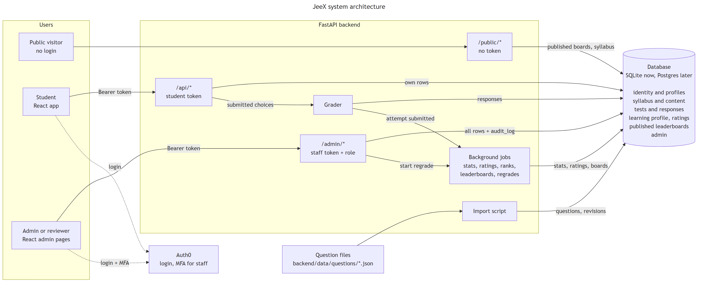

Files: [mermaid](mermaid/01-system-architecture.mmd) · [svg](svg/01-system-architecture.svg) · [png](png/01-system-architecture.png)

## 02 Domain connections

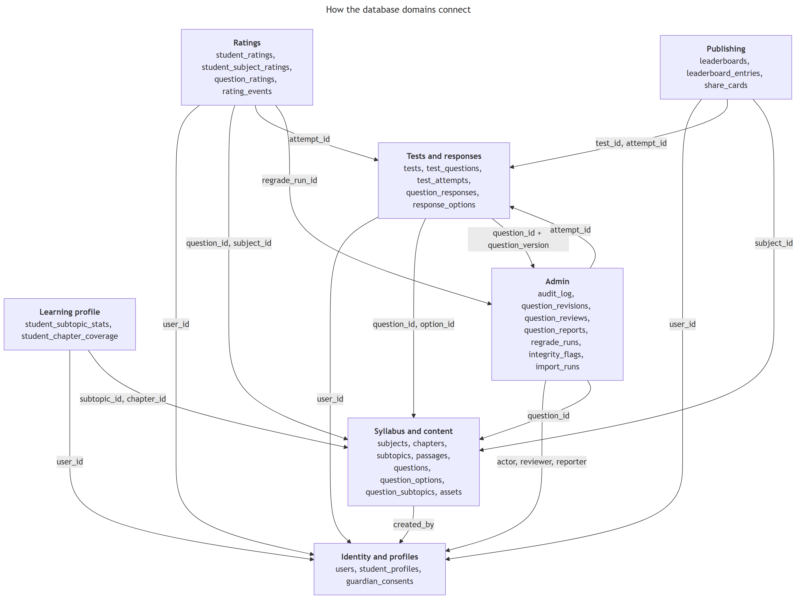

Files: [mermaid](mermaid/02-domain-connections.mmd) · [svg](svg/02-domain-connections.svg) · [png](png/02-domain-connections.png)

## 03 Complete schema

Large — open the [SVG](svg/03-er-complete-schema.svg) in a browser to zoom.

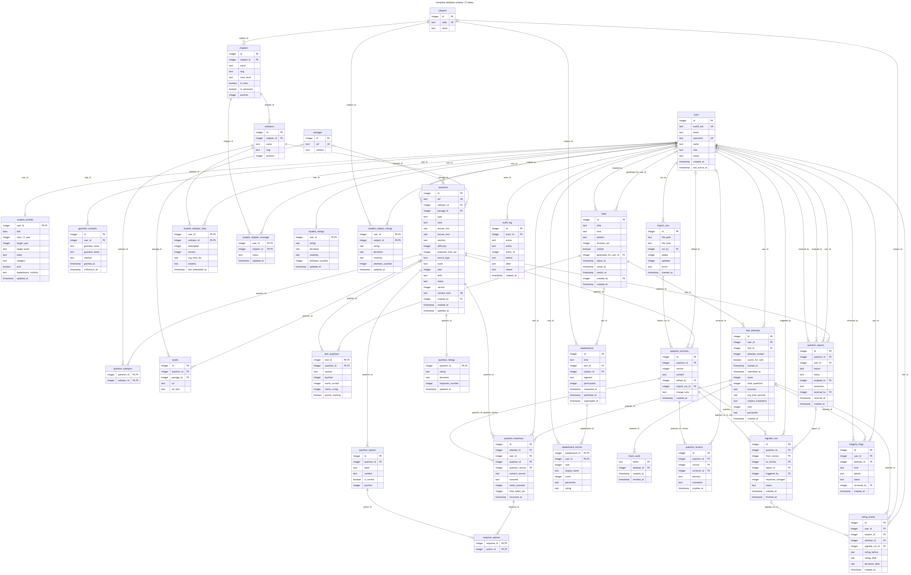

Files: [mermaid](mermaid/03-er-complete-schema.mmd) · [svg](svg/03-er-complete-schema.svg) · [png](png/03-er-complete-schema.png)

## 04 Identity and profiles

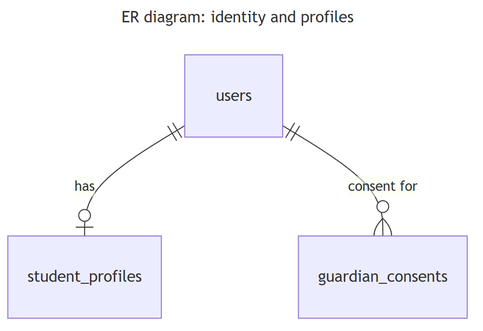

Files: [mermaid](mermaid/04-er-identity-and-profiles.mmd) · [svg](svg/04-er-identity-and-profiles.svg) · [png](png/04-er-identity-and-profiles.png)

## 05 Syllabus and content

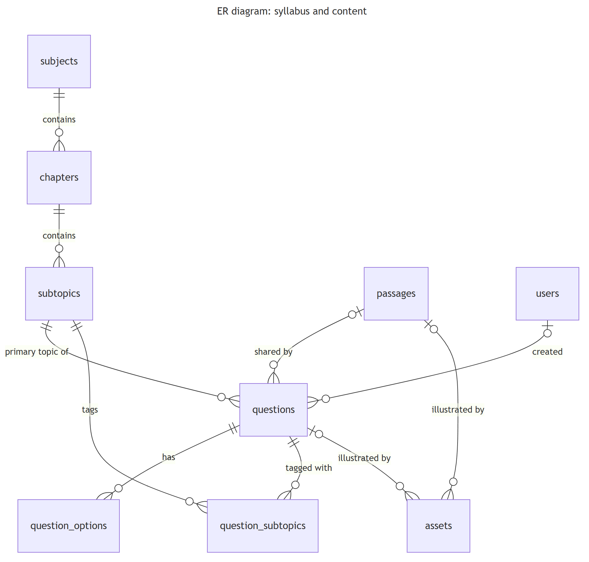

Files: [mermaid](mermaid/05-er-syllabus-and-content.mmd) · [svg](svg/05-er-syllabus-and-content.svg) · [png](png/05-er-syllabus-and-content.png)

## 06 Tests and responses

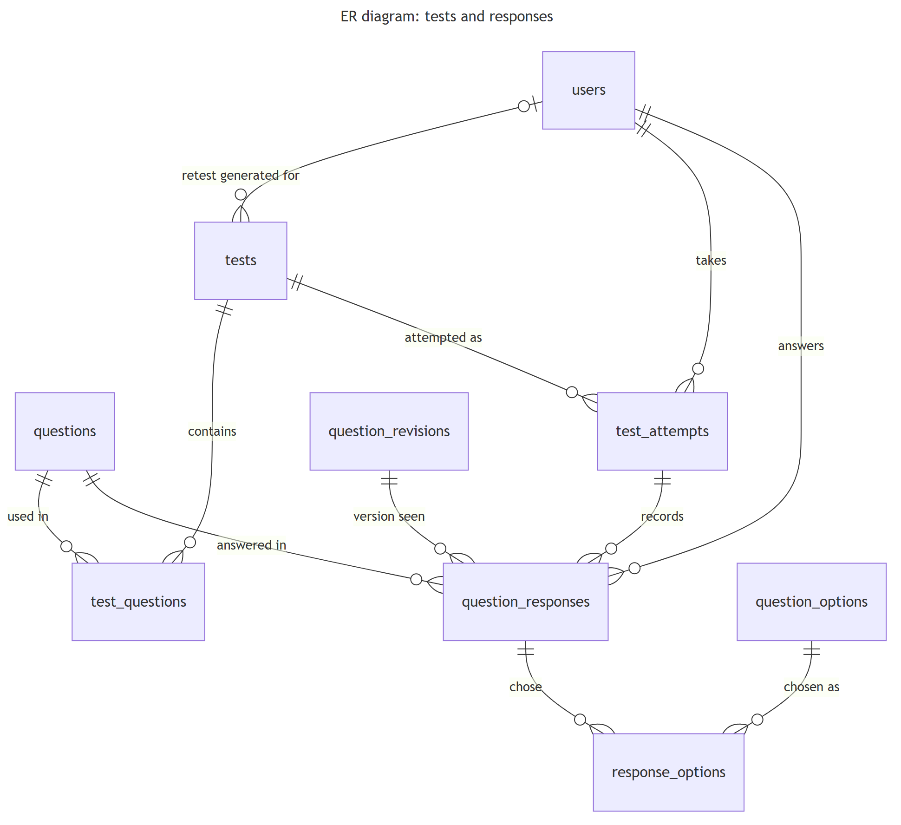

Files: [mermaid](mermaid/06-er-tests-and-responses.mmd) · [svg](svg/06-er-tests-and-responses.svg) · [png](png/06-er-tests-and-responses.png)

## 07 Learning profile

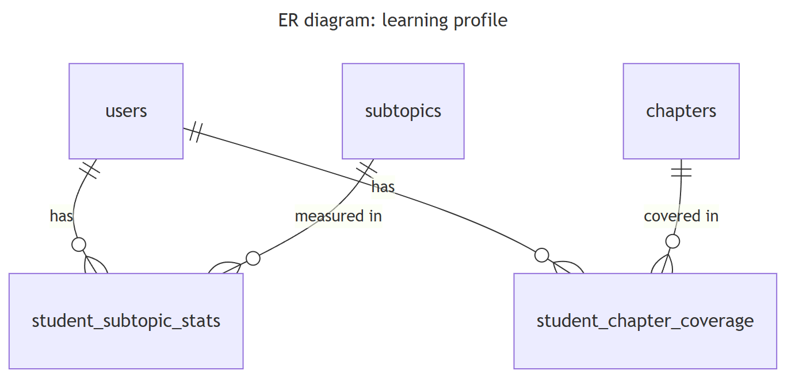

Files: [mermaid](mermaid/07-er-learning-profile.mmd) · [svg](svg/07-er-learning-profile.svg) · [png](png/07-er-learning-profile.png)

## 08 Ratings

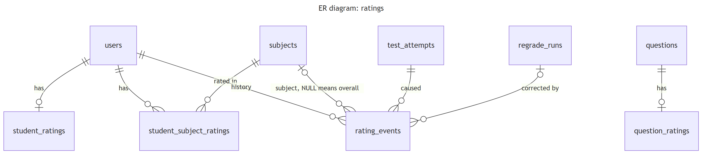

Files: [mermaid](mermaid/08-er-ratings.mmd) · [svg](svg/08-er-ratings.svg) · [png](png/08-er-ratings.png)

## 09 Publishing

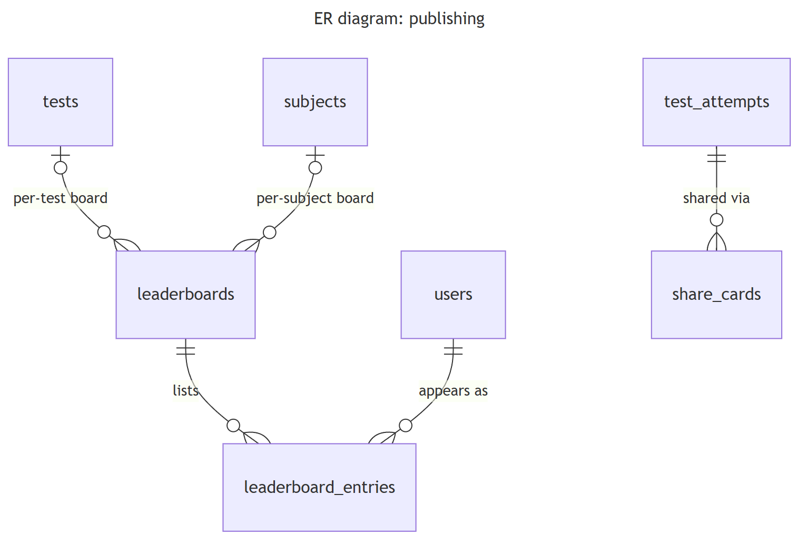

Files: [mermaid](mermaid/09-er-publishing.mmd) · [svg](svg/09-er-publishing.svg) · [png](png/09-er-publishing.png)

## 10 Admin

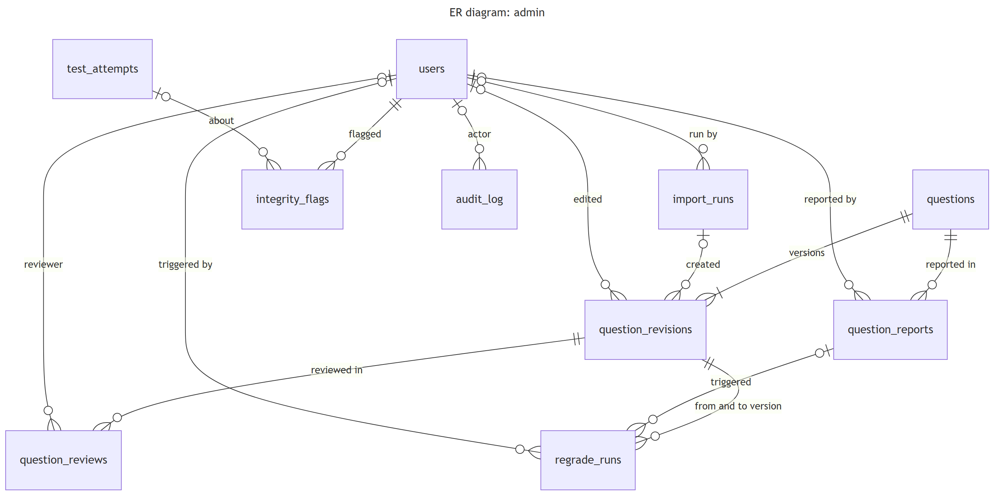

Files: [mermaid](mermaid/10-er-admin.mmd) · [svg](svg/10-er-admin.svg) · [png](png/10-er-admin.png)

## 11 A student takes a ranked mock

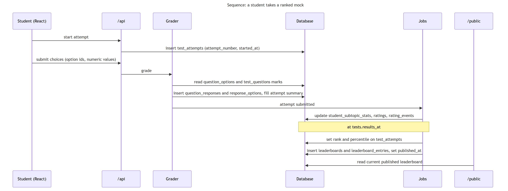

Files: [mermaid](mermaid/11-sequence-student-takes-ranked-mock.mmd) · [svg](svg/11-sequence-student-takes-ranked-mock.svg) · [png](png/11-sequence-student-takes-ranked-mock.png)

## 12 A question from file to regrade

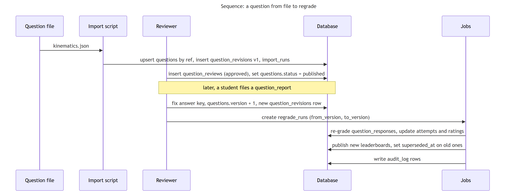

Files: [mermaid](mermaid/12-sequence-question-file-to-regrade.mmd) · [svg](svg/12-sequence-question-file-to-regrade.svg) · [png](png/12-sequence-question-file-to-regrade.png)

---

## Updating the diagrams

- **Source of truth:** diagrams 01, 02 and 04–12 are copies of the Mermaid blocks in
  [`docs/database-schema.md`](../docs/database-schema.md); 03 is generated from its `CREATE TABLE`
  statements. Change the doc first, then update these files, so the two never disagree.
- **Re-render one diagram** after editing its `.mmd` file (the first run downloads a headless
  browser):

  ```bash
  npx -y @mermaid-js/mermaid-cli@11 -i arch/mermaid/01-system-architecture.mmd -o arch/svg/01-system-architecture.svg -b white -w 1800
  npx -y @mermaid-js/mermaid-cli@11 -i arch/mermaid/01-system-architecture.mmd -o arch/png/01-system-architecture.png -b white -w 1800 -s 2
  ```

  Use `-w 4000` for `03-er-complete-schema` so its text stays readable.
