# JeeX Database Schema

The complete target schema for JeeX: question bank, student profiles, tests, learning analytics,
ratings, public leaderboards and admin tooling — one connected database.

**Status:** design. Today only `users` and `test_attempts` exist (`backend/app/models.py`).
See [Migrating from the current code](#14-migrating-from-the-current-code).

**Diagrams:** every diagram in this document is also in [`arch/`](../arch/README.md) as Mermaid
source, SVG and PNG, along with a complete ER diagram showing every column.

## Contents

1. [Architecture](#1-architecture)
2. [How the domains connect](#2-how-the-domains-connect)
3. [Conventions](#3-conventions)
4. [Identity and profiles](#4-identity-and-profiles)
5. [Syllabus and content](#5-syllabus-and-content)
6. [Tests and responses](#6-tests-and-responses)
7. [Learning profile](#7-learning-profile)
8. [Ratings](#8-ratings)
9. [Publishing](#9-publishing)
10. [Admin](#10-admin)
11. [Key queries](#11-key-queries)
12. [Lifecycles](#12-lifecycles)
13. [Rules enforced in application code](#13-rules-enforced-in-application-code)
14. [Migrating from the current code](#14-migrating-from-the-current-code)
15. [Question file import mapping](#15-question-file-import-mapping)
16. [Build order](#16-build-order)

---

## 1. Architecture

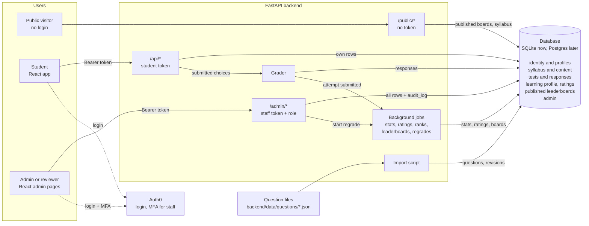

| Component | Responsibility | Reads and writes |
|---|---|---|
| **Auth0** | Hosted login and signup; MFA for staff accounts. | Issues access tokens. The backend checks them against Auth0's public keys (`app/auth.py`). |
| **`/public/*`** | No login. Uses separate response schemas with no internal IDs. | Reads published `leaderboards` and `leaderboard_entries`, `share_cards`, and the syllabus tables. |
| **`/api/*`** | Student endpoints. Every query is scoped to the caller's own `user_id` (the existing `get_current_db_user` pattern in `app/deps.py`). | The caller's rows in identity, tests, learning profile and ratings; published questions inside their tests. |
| **`/admin/*`** | Staff endpoints behind a `require_role(...)` dependency. | Everything. Every write also inserts an `audit_log` row. |
| **Import script** | Loads `backend/data/questions/*.json`, upserting questions by `ref`. | Writes the syllabus and content tables, `question_revisions` and `import_runs`. |
| **Grader** | The only code that decides correctness. The browser sends choices; the server marks them. | Reads `question_options` and `test_questions`; writes `question_responses`, `response_options` and attempt summaries. |
| **Background jobs** | Run after each attempt, at `tests.results_at`, and on regrade. | Write the learning profile, ratings, ranks and leaderboards; run regrades. |

---

## 2. How the domains connect

Arrows point from the table holding the foreign key to the table it references.

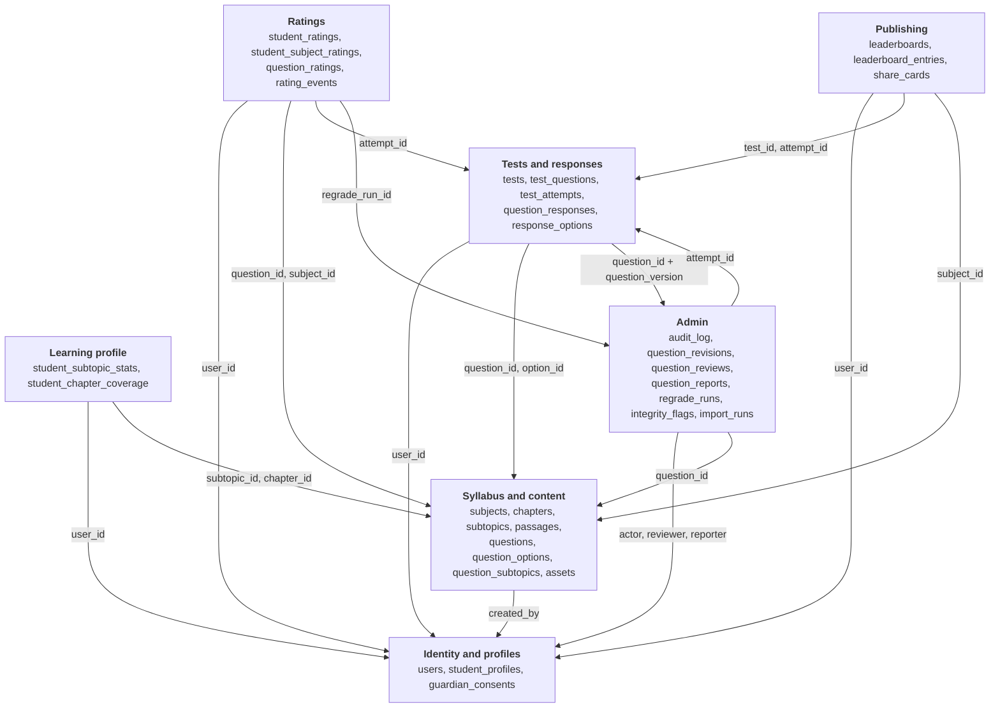

**The hub is `question_responses`:** one row per student, per question, per attempt. Everything
analytical — stats, ratings, ranks, leaderboards, regrades — is computed from it.

### Who can read what

| Domain | Public (no login) | Student (own rows only) | Admin |
|---|---|---|---|
| Identity and profiles | — | own `users` row and profile | all |
| Syllabus and content | subjects, chapters, subtopics | published questions inside their tests; answers and solutions **only after submitting** | all |
| Tests and responses | — | own attempts and responses | all |
| Learning profile | — | own stats and coverage | all |
| Ratings | via published leaderboards only | own ratings and history | all, including `question_ratings` |
| Publishing | published, current leaderboards (display fields only); share cards by token | same | all, including `user_id` |
| Admin | — | can create a `question_reports` row and see its status | all |

---

## 3. Conventions

- **One database, one SQLAlchemy `Base`.** Every table here lives in the same database as `users`.
- **Keys:** `id INTEGER PRIMARY KEY` on entity tables; composite primary keys on pure link tables.
  Foreign keys are named after what they point at (`user_id`, `subtopic_id`, `reviewer_id`).
- **Syllabus links are always foreign keys** (`subject_id`, `chapter_id`, `subtopic_id`) — never a
  copied name like `"Physics"`.
- **Enumerations** are lowercase strings guarded by `CHECK` constraints, with one vocabulary
  everywhere: exams are always `'jee_main' | 'jee_advanced'`.
- **Stable references:** questions and passages carry a human-readable `ref` (`PHY-KIN-001`) that
  survives edits and re-imports. Integer `id`s are internal and never appear in question files.
- **Delete rules:**
  - Student data hangs off `users` with `ON DELETE CASCADE`, so deleting a user erases their data.
  - Content that has been answered is protected with `ON DELETE RESTRICT`; retire it instead.
  - References to staff (`created_by`, `reviewer_id`…) use `ON DELETE SET NULL` so history survives.
- **Derived tables are caches.** Attempt summaries, `student_subtopic_stats`, ratings and
  leaderboards can all be rebuilt from `question_responses`.
- **Times are UTC.**
- **Dialect:** the DDL below is SQLite (the current database). SQLAlchemy models generate the
  Postgres equivalents: identity columns, `TIMESTAMPTZ`, `JSONB`.

---

## 4. Identity and profiles

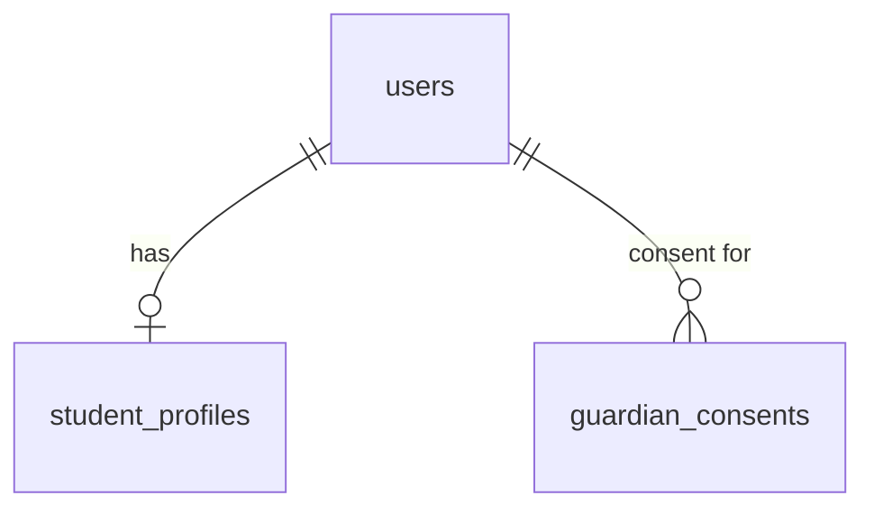

```sql
CREATE TABLE users (
  id              INTEGER PRIMARY KEY,
  auth0_sub       TEXT NOT NULL UNIQUE,          -- stable Auth0 identity
  email           TEXT,
  username        TEXT NOT NULL UNIQUE,          -- public handle on leaderboards
  name            TEXT NOT NULL,                 -- real name; never public
  role            TEXT NOT NULL DEFAULT 'student'
                  CHECK (role IN ('student', 'reviewer', 'admin')),
  status          TEXT NOT NULL DEFAULT 'active'
                  CHECK (status IN ('active', 'suspended')),
  created_at      TIMESTAMP NOT NULL DEFAULT CURRENT_TIMESTAMP,
  last_active_at  TIMESTAMP
);

CREATE TABLE student_profiles (
  user_id                 INTEGER PRIMARY KEY REFERENCES users (id) ON DELETE CASCADE,
  dob                     DATE NOT NULL,
  class_12_year           INTEGER NOT NULL,      -- year of Class 12 boards; derive 11 / 12 / dropper from it
  target_year             INTEGER NOT NULL,      -- JEE cycle being prepared for
  target_exam             TEXT NOT NULL DEFAULT 'jee_main'
                          CHECK (target_exam IN ('jee_main', 'jee_advanced')),
  state                   TEXT,                  -- ISO 3166-2, e.g. 'IN-MH'
  category                TEXT CHECK (category IN ('gen', 'gen_ews', 'obc_ncl', 'sc', 'st')),
  pwd                     BOOLEAN,
  leaderboard_visibility  TEXT NOT NULL DEFAULT 'username'
                          CHECK (leaderboard_visibility IN ('username', 'hidden')),
  updated_at              TIMESTAMP NOT NULL DEFAULT CURRENT_TIMESTAMP,
  CHECK (target_year >= class_12_year)
);

CREATE TABLE guardian_consents (
  id              INTEGER PRIMARY KEY,
  user_id         INTEGER NOT NULL REFERENCES users (id) ON DELETE CASCADE,
  guardian_name   TEXT,
  guardian_email  TEXT NOT NULL,
  method          TEXT NOT NULL,                 -- how consent was verified
  granted_at      TIMESTAMP NOT NULL,
  withdrawn_at    TIMESTAMP
);
```

- **`role`** separates students from staff. Only students get a `student_profiles` row.
- **`class_12_year` replaces `class_level`.** A stored class label goes stale every April; a year
  doesn't. A student is in Class 11 or 12 depending on how far away their board year is, and a
  dropper when it's in the past.
- **`category` and `pwd`** are optional and should only be collected if category-wise rank
  prediction is built. Caste data about minors is sensitive.
- **`guardian_consents`** exists because most users are under 18. India's DPDP Act requires
  verifiable parental consent for children's data — confirm the current rules with a lawyer.

---

## 5. Syllabus and content

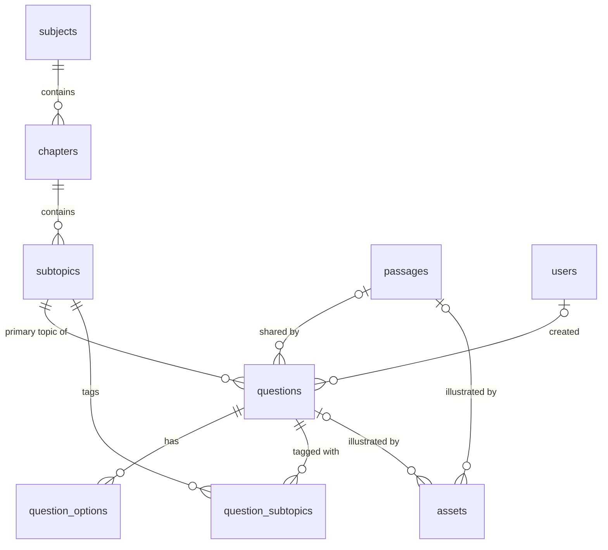

```sql
CREATE TABLE subjects (
  id    INTEGER PRIMARY KEY,
  code  TEXT NOT NULL UNIQUE CHECK (code IN ('PHY', 'CHEM', 'MATH')),
  name  TEXT NOT NULL
);

CREATE TABLE chapters (
  id           INTEGER PRIMARY KEY,
  subject_id   INTEGER NOT NULL REFERENCES subjects (id),
  name         TEXT NOT NULL,
  slug         TEXT NOT NULL,
  class_level  TEXT NOT NULL CHECK (class_level IN ('11', '12')),   -- which year of school teaches it
  in_main      BOOLEAN NOT NULL DEFAULT TRUE,
  in_advanced  BOOLEAN NOT NULL DEFAULT TRUE,
  position     INTEGER NOT NULL DEFAULT 0,
  UNIQUE (subject_id, slug)
);

CREATE TABLE subtopics (
  id          INTEGER PRIMARY KEY,
  chapter_id  INTEGER NOT NULL REFERENCES chapters (id),
  name        TEXT NOT NULL,
  slug        TEXT NOT NULL,
  position    INTEGER NOT NULL DEFAULT 0,
  UNIQUE (chapter_id, slug)
);

CREATE TABLE passages (
  id       INTEGER PRIMARY KEY,
  ref      TEXT NOT NULL UNIQUE,                 -- e.g. 'PHY-KIN-P01'
  content  TEXT NOT NULL                         -- Markdown + LaTeX
);

CREATE TABLE questions (
  id                 INTEGER PRIMARY KEY,
  ref                TEXT NOT NULL UNIQUE,       -- e.g. 'PHY-KIN-001'; identity across edits
  subtopic_id        INTEGER NOT NULL REFERENCES subtopics (id),
  passage_id         INTEGER REFERENCES passages (id),
  type               TEXT NOT NULL
                     CHECK (type IN ('single_correct', 'multi_correct', 'numerical')),
  stem               TEXT NOT NULL,              -- Markdown + LaTeX
  answer_min         REAL,                       -- numerical only; min = max for exact answers
  answer_max         REAL,
  solution           TEXT NOT NULL,              -- Markdown + LaTeX
  difficulty         INTEGER NOT NULL CHECK (difficulty BETWEEN 1 AND 10),   -- 1 = very easy, 10 = very hard
  expected_time_sec  INTEGER NOT NULL,
  source_type        TEXT NOT NULL CHECK (source_type IN ('pyq', 'original', 'adapted')),
  exam               TEXT CHECK (exam IN ('jee_main', 'jee_advanced')),
  year               INTEGER,
  shift              TEXT,                       -- e.g. '27 Jan 2024, Shift 1'
  status             TEXT NOT NULL DEFAULT 'draft'
                     CHECK (status IN ('draft', 'reviewed', 'published', 'retired')),
  version            INTEGER NOT NULL DEFAULT 1, -- bumped on every content change
  content_hash       TEXT NOT NULL UNIQUE,       -- catches duplicate content under different refs
  created_by         INTEGER REFERENCES users (id) ON DELETE SET NULL,
  created_at         TIMESTAMP NOT NULL DEFAULT CURRENT_TIMESTAMP,
  updated_at         TIMESTAMP NOT NULL DEFAULT CURRENT_TIMESTAMP,
  CHECK ((type = 'numerical') = (answer_min IS NOT NULL AND answer_max IS NOT NULL)),
  CHECK (answer_min IS NULL OR answer_min <= answer_max),
  CHECK (source_type <> 'pyq' OR (exam IS NOT NULL AND year IS NOT NULL))
);

CREATE TABLE question_options (
  id           INTEGER PRIMARY KEY,
  question_id  INTEGER NOT NULL REFERENCES questions (id) ON DELETE CASCADE,
  label        TEXT NOT NULL CHECK (label IN ('A', 'B', 'C', 'D')),
  content      TEXT NOT NULL,                    -- Markdown + LaTeX
  is_correct   BOOLEAN NOT NULL,
  position     INTEGER NOT NULL,
  UNIQUE (question_id, label)
);

CREATE TABLE question_subtopics (                -- secondary tags ("also_subtopics" in question files)
  question_id  INTEGER NOT NULL REFERENCES questions (id) ON DELETE CASCADE,
  subtopic_id  INTEGER NOT NULL REFERENCES subtopics (id),
  PRIMARY KEY (question_id, subtopic_id)
);

CREATE TABLE assets (                            -- images (figures, graphs, circuits) shown with a question or passage
  id           INTEGER PRIMARY KEY,
  question_id  INTEGER REFERENCES questions (id) ON DELETE CASCADE,
  passage_id   INTEGER REFERENCES passages (id) ON DELETE CASCADE,
  url          TEXT,                             -- where the image is served from; NULL = needed but not sourced yet
  alt_text     TEXT NOT NULL,                    -- describes the figure well enough to redraw it
  CHECK ((question_id IS NULL) <> (passage_id IS NULL))   -- belongs to exactly one
);
```

- **Three answer types cover every JEE format.** List-match and assertion-reason are single-correct
  questions with a special stem; comprehension questions share a `passage_id`.
- **Options are rows**, so multi-correct works the same as single-correct, and wrong-option
  analysis is a join.
- **Reviews live in `question_reviews`** (section 10), not a `reviewed_by` column, so every review
  of every version is kept.
- **Marks are not stored on questions.** They belong to `test_questions`, because the same question
  is worth different marks in different tests.
- **`difficulty` is a 1–10 scale** judged for a JEE Main aspirant: 1 is direct recall of a formula
  or fact, 5 a typical JEE Main question, 10 among the hardest in a paper. It is the authored
  estimate; `question_ratings` (section 8) is the difficulty measured from real responses.
- **Images live in `assets`**, one row per figure. A question whose figure is known but not yet
  sourced keeps an `assets` row with `url` NULL and a description in `alt_text`, so it can't be
  published without its figure (rule 12).

---

## 6. Tests and responses

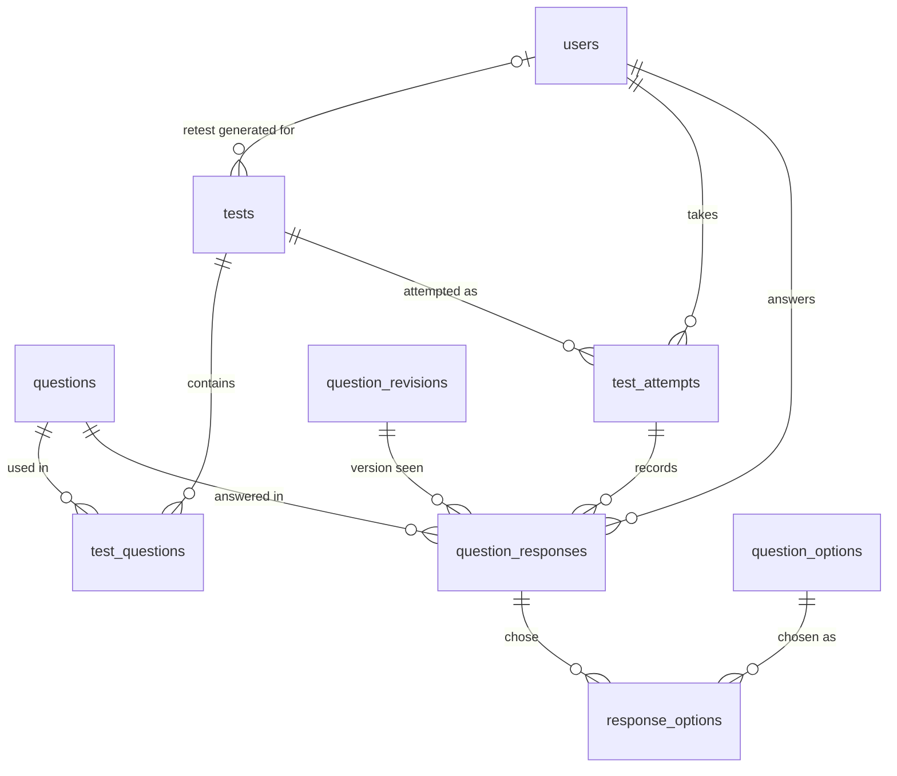

```sql
CREATE TABLE tests (
  id                     INTEGER PRIMARY KEY,
  title                  TEXT NOT NULL,
  kind                   TEXT NOT NULL
                         CHECK (kind IN ('free_diagnostic', 'mock', 'chapter', 'retest')),
  pattern                TEXT NOT NULL CHECK (pattern IN ('jee_main', 'jee_advanced')),
  duration_sec           INTEGER NOT NULL,
  ranked                 BOOLEAN NOT NULL DEFAULT FALSE,
  generated_for_user_id  INTEGER REFERENCES users (id) ON DELETE CASCADE,   -- personalised retests only
  opens_at               TIMESTAMP,
  closes_at              TIMESTAMP,
  results_at             TIMESTAMP,              -- ranks and leaderboards are published at this time
  created_by             INTEGER REFERENCES users (id) ON DELETE SET NULL,
  created_at             TIMESTAMP NOT NULL DEFAULT CURRENT_TIMESTAMP,
  CHECK (kind <> 'retest' OR (generated_for_user_id IS NOT NULL AND ranked = FALSE))
);

CREATE TABLE test_questions (
  test_id          INTEGER NOT NULL REFERENCES tests (id) ON DELETE CASCADE,
  question_id      INTEGER NOT NULL REFERENCES questions (id),
  section          TEXT,
  position         INTEGER NOT NULL,
  marks_correct    INTEGER NOT NULL,             -- e.g. 4
  marks_wrong      INTEGER NOT NULL DEFAULT 0,   -- e.g. -1
  partial_marking  BOOLEAN NOT NULL DEFAULT FALSE,   -- JEE Advanced multi-correct rules
  PRIMARY KEY (test_id, question_id)
);

CREATE TABLE test_attempts (
  id                INTEGER PRIMARY KEY,
  user_id           INTEGER NOT NULL REFERENCES users (id) ON DELETE CASCADE,
  test_id           INTEGER NOT NULL REFERENCES tests (id),
  attempt_number    INTEGER NOT NULL DEFAULT 1,
  counts_for_rank   BOOLEAN NOT NULL DEFAULT FALSE,
  started_at        TIMESTAMP NOT NULL DEFAULT CURRENT_TIMESTAMP,
  submitted_at      TIMESTAMP,
  -- cached summary, rebuilt from question_responses
  score             INTEGER,
  total_questions   INTEGER,
  accuracy          REAL,
  avg_time_seconds  REAL,
  subject_breakdown JSON,                        -- keyed by subject code: {"PHY": {"correct": 3, "total": 4}}
  rank              INTEGER,                     -- set when results are published
  percentile        REAL,
  created_at        TIMESTAMP NOT NULL DEFAULT CURRENT_TIMESTAMP,
  UNIQUE (user_id, test_id, attempt_number)
);

CREATE TABLE question_responses (
  id                INTEGER PRIMARY KEY,
  attempt_id        INTEGER NOT NULL REFERENCES test_attempts (id) ON DELETE CASCADE,
  user_id           INTEGER NOT NULL REFERENCES users (id) ON DELETE CASCADE,   -- copied from the attempt for fast per-student queries
  question_id       INTEGER NOT NULL REFERENCES questions (id) ON DELETE RESTRICT,
  question_version  INTEGER NOT NULL,            -- exactly what the student saw
  numeric_answer    REAL,
  outcome           TEXT NOT NULL
                    CHECK (outcome IN ('correct', 'partial', 'wrong', 'skipped', 'timed_out')),
  marks_awarded     INTEGER NOT NULL DEFAULT 0,
  time_taken_sec    INTEGER NOT NULL,
  answered_at       TIMESTAMP NOT NULL DEFAULT CURRENT_TIMESTAMP,
  UNIQUE (attempt_id, question_id),
  FOREIGN KEY (question_id, question_version)
    REFERENCES question_revisions (question_id, version)
);

CREATE INDEX ix_question_responses_user_question
  ON question_responses (user_id, question_id);

CREATE TABLE response_options (                  -- the option(s) the student picked
  response_id  INTEGER NOT NULL REFERENCES question_responses (id) ON DELETE CASCADE,
  option_id    INTEGER NOT NULL REFERENCES question_options (id) ON DELETE RESTRICT,
  PRIMARY KEY (response_id, option_id)
);
```

- **The free test becomes a `tests` row** with `kind = 'free_diagnostic'`. `FreeTest.jsx` then
  fetches its questions from the API instead of `freeTestQuestions.js`.
- **`question_version` points at an exact `question_revisions` row**, so a response always records
  which wording and answer key the student was graded against.
- **Choices are stored, not just the result.** When an answer key is corrected, every past response
  can be re-graded from `response_options`.

---

## 7. Learning profile

Private to each student; derived from `question_responses`.

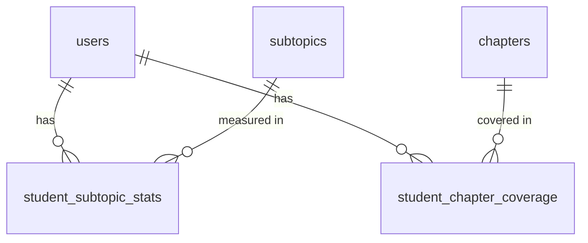

```sql
CREATE TABLE student_subtopic_stats (
  user_id            INTEGER NOT NULL REFERENCES users (id) ON DELETE CASCADE,
  subtopic_id        INTEGER NOT NULL REFERENCES subtopics (id),
  attempted          INTEGER NOT NULL DEFAULT 0,
  correct            INTEGER NOT NULL DEFAULT 0,
  avg_time_sec       REAL,
  mastery            REAL NOT NULL DEFAULT 0.5 CHECK (mastery BETWEEN 0 AND 1),
  last_attempted_at  TIMESTAMP,
  PRIMARY KEY (user_id, subtopic_id)
);

CREATE TABLE student_chapter_coverage (
  user_id     INTEGER NOT NULL REFERENCES users (id) ON DELETE CASCADE,
  chapter_id  INTEGER NOT NULL REFERENCES chapters (id),
  status      TEXT NOT NULL DEFAULT 'not_started'
              CHECK (status IN ('not_started', 'in_progress', 'done')),
  updated_at  TIMESTAMP NOT NULL DEFAULT CURRENT_TIMESTAMP,
  PRIMARY KEY (user_id, chapter_id)
);
```

- **`mastery`** starts as accuracy weighted towards recent and harder questions. The formula can
  change later without changing the table.
- **`student_chapter_coverage`** keeps mocks to chapters a student has actually studied. Pre-fill it
  from `class_12_year` and `chapters.class_level`, then let students adjust it.

---

## 8. Ratings

Glicko-2. Each answer is a match between the student's rating and the question's rating.

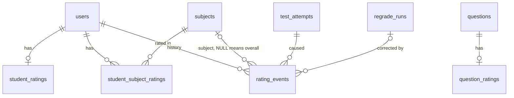

```sql
CREATE TABLE student_ratings (                   -- overall rating
  user_id           INTEGER PRIMARY KEY REFERENCES users (id) ON DELETE CASCADE,
  rating            REAL NOT NULL DEFAULT 1500,
  deviation         REAL NOT NULL DEFAULT 350,   -- uncertainty; hide from boards while high
  volatility        REAL NOT NULL DEFAULT 0.06,
  attempts_counted  INTEGER NOT NULL DEFAULT 0,
  updated_at        TIMESTAMP NOT NULL DEFAULT CURRENT_TIMESTAMP
);

CREATE TABLE student_subject_ratings (
  user_id           INTEGER NOT NULL REFERENCES users (id) ON DELETE CASCADE,
  subject_id        INTEGER NOT NULL REFERENCES subjects (id),
  rating            REAL NOT NULL DEFAULT 1500,
  deviation         REAL NOT NULL DEFAULT 350,
  volatility        REAL NOT NULL DEFAULT 0.06,
  attempts_counted  INTEGER NOT NULL DEFAULT 0,
  updated_at        TIMESTAMP NOT NULL DEFAULT CURRENT_TIMESTAMP,
  PRIMARY KEY (user_id, subject_id)
);

CREATE TABLE question_ratings (                  -- measured difficulty; admin-only
  question_id        INTEGER PRIMARY KEY REFERENCES questions (id) ON DELETE CASCADE,
  rating             REAL NOT NULL DEFAULT 1500,
  deviation          REAL NOT NULL DEFAULT 350,
  responses_counted  INTEGER NOT NULL DEFAULT 0,
  updated_at         TIMESTAMP NOT NULL DEFAULT CURRENT_TIMESTAMP
);

CREATE TABLE rating_events (                     -- every change; powers rating graphs and rebuilds
  id               INTEGER PRIMARY KEY,
  user_id          INTEGER NOT NULL REFERENCES users (id) ON DELETE CASCADE,
  subject_id       INTEGER REFERENCES subjects (id),               -- NULL = overall rating
  attempt_id       INTEGER NOT NULL REFERENCES test_attempts (id) ON DELETE CASCADE,
  regrade_run_id   INTEGER REFERENCES regrade_runs (id),           -- set when a regrade caused it
  rating_before    REAL NOT NULL,
  rating_after     REAL NOT NULL,
  deviation_after  REAL NOT NULL,
  created_at       TIMESTAMP NOT NULL DEFAULT CURRENT_TIMESTAMP
);
```

- **Why Glicko-2:** personalised retests give every student different questions, so raw scores
  can't be compared. Beating a highly rated question counts for more.
- **Provisional ratings** (high `deviation`, e.g. above 100, or fewer than 3 counted attempts) stay
  off rating leaderboards.
- **Chapter-level numbers stay private** as `mastery` in `student_subtopic_stats`; public ratings
  are overall and per subject only.

---

## 9. Publishing

The only data the public API can read. Leaderboards are saved snapshots, not live queries.

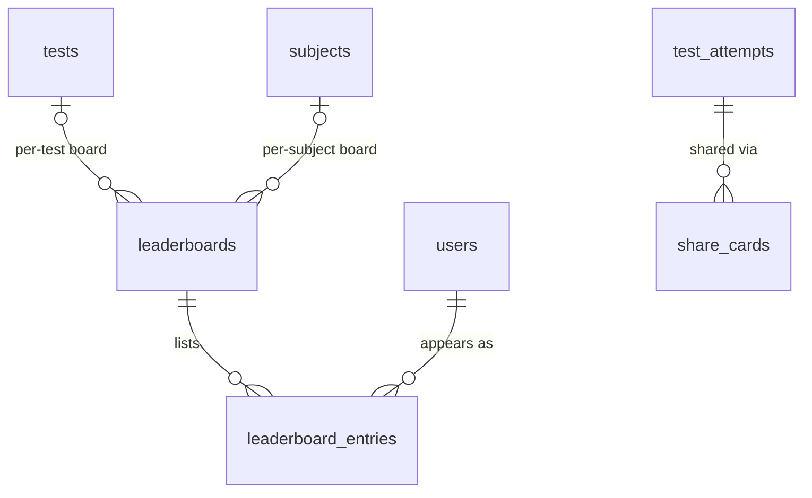

```sql
CREATE TABLE leaderboards (
  id             INTEGER PRIMARY KEY,
  kind           TEXT NOT NULL CHECK (kind IN ('test', 'rating')),
  test_id        INTEGER REFERENCES tests (id),       -- set for per-test boards
  subject_id     INTEGER REFERENCES subjects (id),    -- NULL = overall
  segment        TEXT NOT NULL DEFAULT 'all',         -- 'all' | 'state:IN-MH' | 'year:2027'
  participants   INTEGER NOT NULL DEFAULT 0,
  computed_at    TIMESTAMP NOT NULL DEFAULT CURRENT_TIMESTAMP,
  published_at   TIMESTAMP,                           -- public API serves only published boards
  superseded_at  TIMESTAMP,                           -- set when a regrade republishes the board
  CHECK ((kind = 'test') = (test_id IS NOT NULL))
);

CREATE TABLE leaderboard_entries (
  leaderboard_id  INTEGER NOT NULL REFERENCES leaderboards (id) ON DELETE CASCADE,
  user_id         INTEGER NOT NULL REFERENCES users (id) ON DELETE CASCADE,   -- never sent by /public
  rank            INTEGER NOT NULL,
  display_name    TEXT NOT NULL,                       -- username or 'Anonymous', fixed at publish time
  score           INTEGER,
  percentile      REAL,
  rating          REAL,
  PRIMARY KEY (leaderboard_id, user_id)
);

CREATE INDEX ix_leaderboard_entries_rank
  ON leaderboard_entries (leaderboard_id, rank);

CREATE TABLE share_cards (                             -- opt-in public link to one result
  token       TEXT PRIMARY KEY,                        -- random and unguessable, never an id
  attempt_id  INTEGER NOT NULL REFERENCES test_attempts (id) ON DELETE CASCADE,
  created_at  TIMESTAMP NOT NULL DEFAULT CURRENT_TIMESTAMP,
  revoked_at  TIMESTAMP
);
```

**Who appears:**
- Only attempts with `counts_for_rank = TRUE`: first attempt, submitted inside the test window, on a
  `ranked` test.
- Students with `leaderboard_visibility = 'hidden'` are ranked but shown as `'Anonymous'`, so
  everyone else's rank stays honest.
- Suspended users and attempts with open `integrity_flags` are excluded.
- **Percentile** uses NTA's formula: `100 × (candidates scoring ≤ you) / total candidates`. Equal
  scores share a rank.

---

## 10. Admin

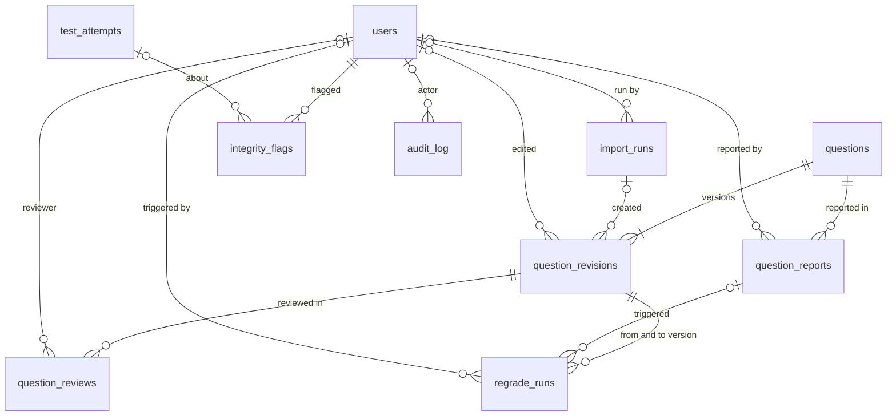

```sql
CREATE TABLE import_runs (
  id          INTEGER PRIMARY KEY,
  file_path   TEXT NOT NULL,
  file_hash   TEXT NOT NULL,
  run_by      INTEGER REFERENCES users (id) ON DELETE SET NULL,
  added       INTEGER NOT NULL DEFAULT 0,
  updated     INTEGER NOT NULL DEFAULT 0,
  errors      JSON,
  created_at  TIMESTAMP NOT NULL DEFAULT CURRENT_TIMESTAMP
);

CREATE TABLE question_revisions (                -- one row per version of every question
  id             INTEGER PRIMARY KEY,
  question_id    INTEGER NOT NULL REFERENCES questions (id) ON DELETE CASCADE,
  version        INTEGER NOT NULL,
  content        JSON NOT NULL,                  -- stem, image, options, answer and solution as they were
  edited_by      INTEGER REFERENCES users (id) ON DELETE SET NULL,
  import_run_id  INTEGER REFERENCES import_runs (id),
  change_note    TEXT,
  created_at     TIMESTAMP NOT NULL DEFAULT CURRENT_TIMESTAMP,
  UNIQUE (question_id, version)
);

CREATE TABLE question_reviews (                  -- the draft -> reviewed -> published workflow
  id           INTEGER PRIMARY KEY,
  question_id  INTEGER NOT NULL,
  version      INTEGER NOT NULL,
  reviewer_id  INTEGER REFERENCES users (id) ON DELETE SET NULL,
  decision     TEXT NOT NULL
               CHECK (decision IN ('approved', 'changes_requested', 'rejected')),
  comments     TEXT,
  created_at   TIMESTAMP NOT NULL DEFAULT CURRENT_TIMESTAMP,
  FOREIGN KEY (question_id, version)
    REFERENCES question_revisions (question_id, version) ON DELETE CASCADE
);

CREATE TABLE question_reports (                  -- students flag errors; staff resolve them
  id           INTEGER PRIMARY KEY,
  question_id  INTEGER NOT NULL REFERENCES questions (id),
  user_id      INTEGER REFERENCES users (id) ON DELETE SET NULL,
  reason       TEXT NOT NULL,
  status       TEXT NOT NULL DEFAULT 'open'
               CHECK (status IN ('open', 'fixed', 'rejected')),
  assigned_to  INTEGER REFERENCES users (id) ON DELETE SET NULL,
  resolution   TEXT,
  resolved_by  INTEGER REFERENCES users (id) ON DELETE SET NULL,
  resolved_at  TIMESTAMP,
  created_at   TIMESTAMP NOT NULL DEFAULT CURRENT_TIMESTAMP
);

CREATE TABLE regrade_runs (                      -- answer key fixed -> re-grade -> re-rank
  id                 INTEGER PRIMARY KEY,
  question_id        INTEGER NOT NULL,
  from_version       INTEGER NOT NULL,
  to_version         INTEGER NOT NULL,
  report_id          INTEGER REFERENCES question_reports (id),
  triggered_by       INTEGER REFERENCES users (id) ON DELETE SET NULL,
  responses_changed  INTEGER NOT NULL DEFAULT 0,
  status             TEXT NOT NULL DEFAULT 'pending'
                     CHECK (status IN ('pending', 'running', 'done', 'failed')),
  created_at         TIMESTAMP NOT NULL DEFAULT CURRENT_TIMESTAMP,
  finished_at        TIMESTAMP,
  FOREIGN KEY (question_id, from_version) REFERENCES question_revisions (question_id, version),
  FOREIGN KEY (question_id, to_version)   REFERENCES question_revisions (question_id, version),
  CHECK (to_version > from_version)
);

CREATE TABLE integrity_flags (
  id           INTEGER PRIMARY KEY,
  user_id      INTEGER NOT NULL REFERENCES users (id) ON DELETE CASCADE,
  attempt_id   INTEGER REFERENCES test_attempts (id) ON DELETE CASCADE,
  kind         TEXT NOT NULL
               CHECK (kind IN ('too_fast', 'answer_pattern_match', 'multi_account')),
  details      JSON,
  status       TEXT NOT NULL DEFAULT 'open'
               CHECK (status IN ('open', 'cleared', 'actioned')),
  reviewed_by  INTEGER REFERENCES users (id) ON DELETE SET NULL,
  created_at   TIMESTAMP NOT NULL DEFAULT CURRENT_TIMESTAMP
);

CREATE TABLE audit_log (                         -- one row per admin write, same transaction
  id          INTEGER PRIMARY KEY,
  actor_id    INTEGER REFERENCES users (id) ON DELETE SET NULL,
  action      TEXT NOT NULL,                     -- e.g. 'question.publish', 'user.suspend'
  entity      TEXT NOT NULL,                     -- table name
  entity_id   INTEGER,
  before      JSON,
  after       JSON,
  reason      TEXT,
  created_at  TIMESTAMP NOT NULL DEFAULT CURRENT_TIMESTAMP
);
```

- **Every version of a question has a `question_revisions` row**, including version 1. The
  composite foreign keys from responses, reviews and regrades all point at exact versions.
- **The regrade chain is traceable end to end:** `question_reports` → new `question_revisions` row →
  `regrade_runs` → re-graded `question_responses` → `rating_events.regrade_run_id` → republished
  `leaderboards` → `audit_log`.

---

## 11. Key queries

**Candidate questions for a personalised retest** — joins every profile table to the question bank:

```sql
SELECT q.id, q.ref, COALESCE(s.mastery, 0.5) AS mastery
FROM questions q
JOIN subtopics st ON st.id = q.subtopic_id
JOIN chapters  c  ON c.id  = st.chapter_id
JOIN student_chapter_coverage cc
     ON cc.chapter_id = c.id AND cc.user_id = :uid AND cc.status <> 'not_started'
LEFT JOIN student_subtopic_stats s
     ON s.subtopic_id = st.id AND s.user_id = :uid
WHERE q.status = 'published'
  AND (c.in_main OR (:target_exam = 'jee_advanced' AND c.in_advanced))
  AND (:target_exam = 'jee_advanced' OR q.type <> 'multi_correct')
  AND q.id NOT IN (SELECT r.question_id FROM question_responses r
                   WHERE r.user_id = :uid AND r.answered_at > :cutoff)
ORDER BY mastery ASC
LIMIT 30;
```

**A student's weakest subtopics** (dashboard):

```sql
SELECT sub.code AS subject, c.name AS chapter, st.name AS subtopic,
       s.mastery, s.attempted
FROM student_subtopic_stats s
JOIN subtopics st ON st.id = s.subtopic_id
JOIN chapters  c  ON c.id  = st.chapter_id
JOIN subjects sub ON sub.id = c.subject_id
WHERE s.user_id = :uid
ORDER BY s.mastery ASC
LIMIT 5;
```

**Public leaderboard for a test** (`/public`) — display fields only:

```sql
SELECT e.rank, e.display_name, e.score, e.percentile
FROM leaderboards l
JOIN leaderboard_entries e ON e.leaderboard_id = l.id
WHERE l.kind = 'test' AND l.test_id = :test_id AND l.segment = 'all'
  AND l.published_at IS NOT NULL AND l.superseded_at IS NULL
ORDER BY e.rank
LIMIT 100;
```

**Responses affected by an answer-key fix** (regrade job):

```sql
SELECT r.id, r.attempt_id, r.user_id
FROM question_responses r
WHERE r.question_id = :question_id AND r.question_version < :new_version;
```

---

## 12. Lifecycles

### A student takes a ranked mock

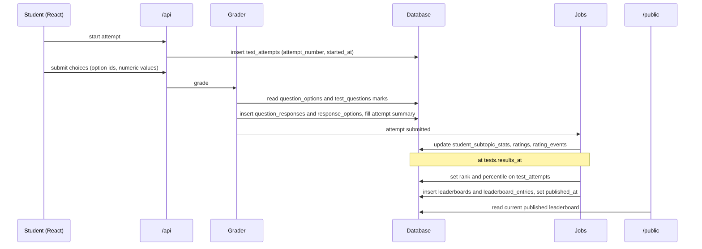

### A question from file to regrade

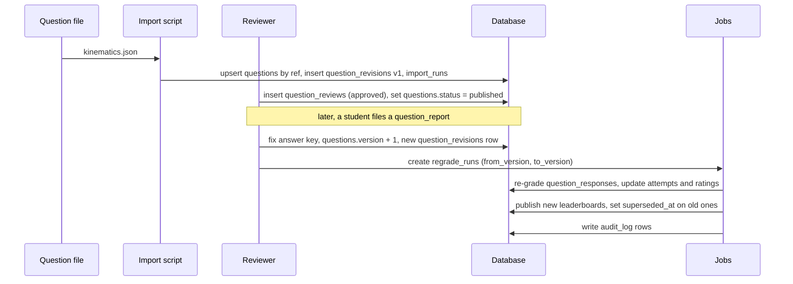

---

## 13. Rules enforced in application code

These span tables, so a database constraint can't express them. The import script, grader and
API must check them.

**Content**
1. `single_correct` has exactly 4 options with 1 correct; `multi_correct` has at least 1 correct;
   `numerical` has no options.
2. When a question's content changes (`content_hash` differs), bump `questions.version` and insert a
   `question_revisions` row in the same transaction. The hash covers the image `url` and `alt_text`
   too, so swapping a figure is a new version.
3. Once a question has responses, update its options in place by `(question_id, label)`. Never
   delete and recreate them — `response_options` points at option ids.

**Tests and grading**
4. `question_responses.user_id` equals the user of its `attempt_id`.
5. A response's question belongs to the attempt's test (`test_questions`).
6. Every `response_options.option_id` belongs to the response's question.
7. Only `published` questions go into tests. Answers and solutions are never sent to the browser
   before the attempt is submitted.
8. `counts_for_rank` is true only for attempt 1, submitted between `opens_at` and `closes_at`, on a
   `ranked` test.

**Publishing and admin**
9. At most one current board (published, not superseded) per `kind`, `test_id`, `subject_id` and
   `segment`.
10. Every `/admin` write inserts an `audit_log` row in the same transaction.
12. A question can't move past `draft` while any of its `assets` rows has a NULL `url`.

**Database settings**
11. **SQLite ignores foreign keys unless each connection runs `PRAGMA foreign_keys = ON`.** Add a
    SQLAlchemy `connect` event listener in `app/database.py`, or none of the constraints in this
    document are enforced.

---

## 14. Migrating from the current code

`jeex.db` holds only local test data today, so deleting and recreating it is the simplest path. Set
up Alembic first — `create_all` cannot change existing tables.

| Today | Target |
|---|---|
| `users.dob`, `users.class_level` | move to `student_profiles`; convert `class_level` to `class_12_year` and `target_year` |
| `users` | add `role`, `status`, `last_active_at` |
| `test_attempts.test_type` | replaced by `tests.kind`; create one `free_diagnostic` test and point old attempts at it via `test_id` |
| `test_attempts.subject_breakdown` (TEXT keyed by subject name) | JSON keyed by subject code, rebuilt from `question_responses` |
| `TestAttemptIn` (browser sends score) | browser sends choices; the grader computes the score |
| `frontend/src/data/freeTestQuestions.js` | the `free_diagnostic` test's questions, served by the API |
| `lib/pendingFreeTest.js` stashes totals | stashes per-question choices, graded after onboarding |

Converting `class_level`, where `Y` is the year the current session's Class 12 boards happen (2027
for the 2026–27 session):

| `class_level` | `class_12_year` | `target_year` |
|---|---|---|
| `'11'` | Y + 1 | Y + 1 |
| `'12'` | Y | Y |
| `'dropper'` | Y − 1 | Y |

Suggested model layout: `app/models/` split into `identity.py`, `content.py`, `tests.py`,
`learning.py`, `ratings.py`, `publishing.py` and `admin.py`, all sharing the one `Base`.

---

## 15. Question file import mapping

How `backend/data/questions/<subject>/<chapter>.json` maps onto the tables:

| File field | Table and column |
|---|---|
| `subject` | `subjects.code` (looked up) |
| `chapter.*` | `chapters` (upsert by `subject_id` + `slug`) |
| `subtopics[]` | `subtopics` (upsert by `chapter_id` + `slug`) |
| `passages[].ref`, `.content` | `passages.ref`, `passages.content` |
| `questions[].ref` | `questions.ref` — the upsert key |
| `.subtopic` | `questions.subtopic_id`, by slug within the file's chapter |
| `.also_subtopics[]` | `question_subtopics` rows |
| `.passage` | `questions.passage_id`, by passage `ref` |
| `.options[]` | `question_options`; `position` = array index + 1 |
| `.answer.min`, `.answer.max` | `questions.answer_min`, `questions.answer_max` |
| `.image` | one `assets` row for the question; `null` or absent means no figure |
| `.image.url` | `assets.url`; `null` when the figure is known but not sourced yet |
| `.image.alt` | `assets.alt_text` |
| `.difficulty` | `questions.difficulty`, an integer from 1 (very easy) to 10 (very hard) |
| `.type`, `.stem`, `.solution`, `.expected_time_sec`, `.source_type`, `.exam`, `.year`, `.shift`, `.status` | same-named `questions` columns |
| *(computed)* | `questions.content_hash`, `questions.version` |
| *(each run)* | one `import_runs` row; one `question_revisions` row per new or changed question |

---

## 16. Build order

Each step works on its own; later steps read from earlier ones.

1. **Content:** syllabus tables, questions, options, `question_revisions`, `import_runs`, and the
   import script. Load `kinematics.json`.
2. **Tests and responses:** tests, test questions, attempts, responses and the grader. Move the
   free test onto the database.
3. **Profiles:** `role` and `status` on `users`, `student_profiles`, `student_chapter_coverage`,
   `guardian_consents`.
4. **Learning profile:** `student_subtopic_stats`, the retest query.
5. **Ratings:** Glicko-2 tables and the rating job.
6. **Publishing:** ranks, leaderboards, share cards, the `/public` router.
7. **Admin tooling:** reviews, reports, regrades, integrity flags, `audit_log`, the `/admin`
   router. Start `audit_log` alongside step 1 if staff will edit content early.
